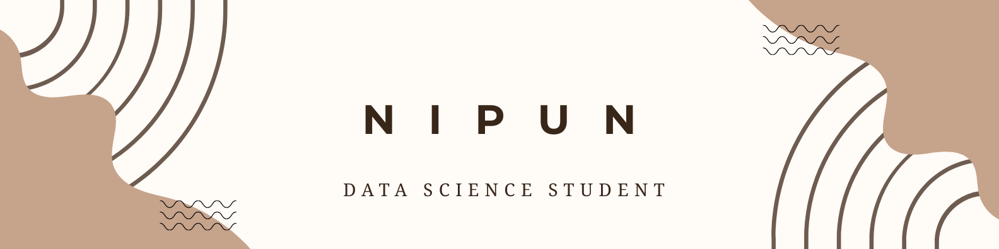

  

  <h1 align="center">Hi, I’m Nipun 👋</h1>

<i>Data Science student • Learning deeply, building slowly</i>

  

  

---

## 👋 About Me

<table>
<tr><td>

🎓 **Data Science undergraduate**  
💻 **C • Java • Python**  
🌱 **Learning HTML • CSS • JavaScript**  
🧠 **Interested in logic, systems & problem-solving**  
📖 **Learning in public, step by step**

</td></tr>
</table>

---
## 🛠 Tech Stack

  

## 🔗 Find Me Online

  
  
  
  
  

---

## 🧪 What I’m Working On

<table>
<tr>
<td width="50%">

### 🧠 Programming Fundamentals  
**C · Java · Python**

- Strengthening logic & syntax  
- Writing clean, readable code  
- Building discipline through practice  

</td>

<td width="50%">

### 🌐 Frontend Foundations  
**HTML · CSS · JavaScript**

- Starting with core web basics  
- Learning how the web really works  
- No frameworks yet — fundamentals only  

</td>
</tr>
</table>

---
## 🧩 Problem Solving Journey

<i>Tracking consistency, not speed.</i>

  

## 🧩 Problem Solving (Planned)

- 🚧 DSA not started yet (intentionally)
- 🟢 Will begin with JAVA
- 📊 Progress will be tracked once started  

> I care more about **clarity** than speed.

---

## 🛠 Languages & Tools

### Languages I Know

  

### Currently Learning

  

---

## 📊 GitHub Activity

  

  

---

  <b>⚡ Learning honestly. Improving daily. No shortcuts.</b> 
  ⭐ Thanks for visiting my profile

---

  <b>Foundations first. Hype later.</b> 
  — Nipun

